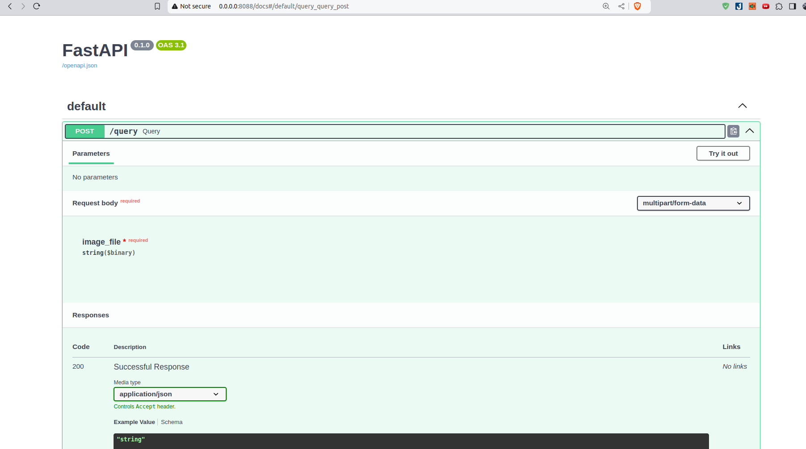
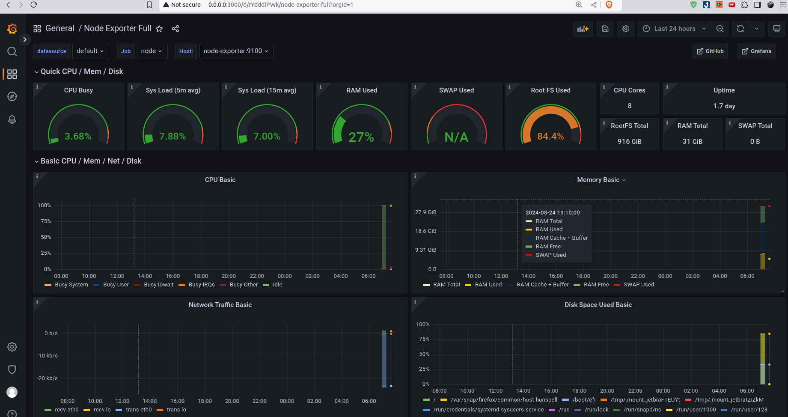

# Cards image classification

## 1. How to prepare dataset
- Download dataset from [here](https://www.kaggle.com/datasets/gpiosenka/cards-image-datasetclassification)
- Then
```
mkdir cards-image-datasetclassification
mv cards-image-datasetclassification.zip cards-image-datasetclassification
cd cards-image-datasetclassification
unzip -q cards-image-datasetclassification.zip
```
## 2. Set up environment
```
conda create -n myenv python=3.9
conda activate myenv
pip install -r requirements.txt
```
## 3.Training process
Training script:
```
python main.py --train-folder ${train_folder} --test-folder ${valid_folder} --batch-size ${bs}  --learning-rate ${lr} --epochs ${epochs}

```
Example:
```
python main.py -bs 16 --epochs 1
```

## 4. Serve model
After training, we have the model saved in `model` folder. We can run FastAPI to serve the model.
```
cd app
python main.py
```
Then open browser and go to `localhost:8088/docs` to see the API documentation.


## 5. Set up Grafana dashboard

```
docker compose -f grafana/docker-compose.yml up -d
```
Then open browser and go to `localhost:3000` to see the Grafana dashboard.

## 6. Additonal
### Set up pre-commit
```
pre-commit install
pre-commit run --all-files
```
