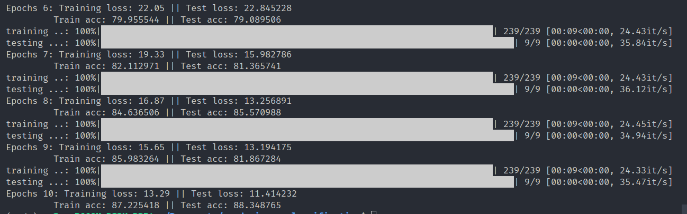

# Cards image classification

## How to prepare dataset
- Download dataset from [here](https://www.kaggle.com/datasets/gpiosenka/cards-image-datasetclassification)
- Then
```
mkdir cards-image-datasetclassification
mv cards-image-datasetclassification.zip cards-image-datasetclassification
cd cards-image-datasetclassification
unzip -q cards-image-datasetclassification.zip
```

## How to run
```
python main.py
```
## Result
